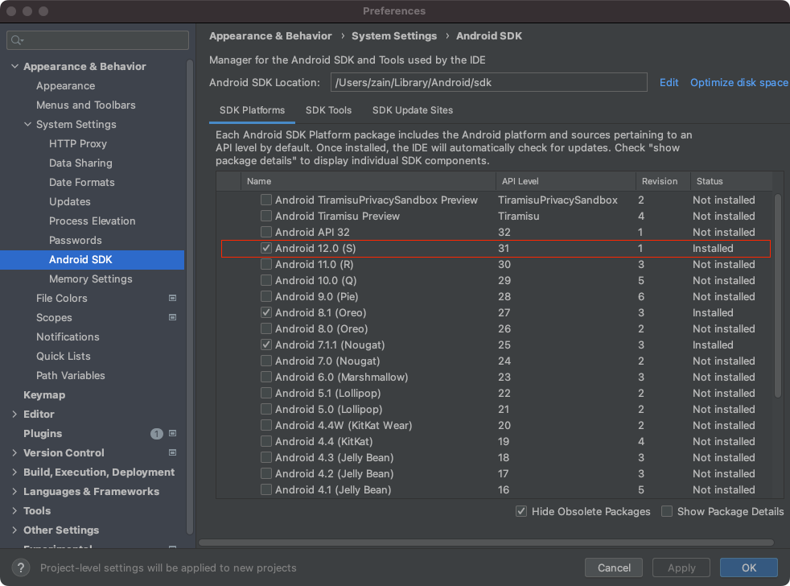

## Eflect Android Test App

This is a test app for Eflect's Android implementation.

### Prerequisites

Following technologies are required to install and run this app on an android device.
* [Install Bazel](https://bazel.build/install)
* [Install Android Studio](https://developer.android.com/studio/install)
* After installing Android Studio, install Android 12.0 SDK (Api level = 31) from within Android Studio > Settings > Appearance & Behavior > System Settings > Android SDK, as shown below.
* Obtain a YouTube API Key by following the steps [here](https://developers.google.com/youtube/v3/getting-started).




### Installation
Make sure all the prerequisites above are properly installed before following the instructions below.
1. Clone this repo to your local machine.
   ```
   git clone https://github.com/zainasir/eflect-android-test.git
   ```
2. In [MainActivity.java](./src/main/java/com/example/bazel/MainActivity.java), set the YOUTUBE_API variable to the API Key you generated above.
   ```java
     private final String YOUTUBE_API = "<YOUR-YOUTUBE-API-KEY>";
   ```
3. Switch into the root directory, same level as where the file [Workspace](/WORKSPACE) is located.
4. Connect an android phone to your machine using usb-a or usb-c.
5. Install the app on your phone:
   ```
   bazel mobile-install //src/main:app
   ```
6. If build completed successfully, you will see a "Eflect Test" app on your phone.